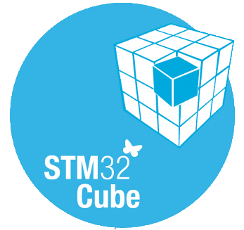

<h1 align="center">Hallo 👋, I'm <a href="https://www.linkedin.com/in/rohitsarov/">Rohit</a></h1>

<h3 align="center">working on dumb stuff</h3>

- 🔭 I’m currently working on **Embedded Hardware Design**

- 🌱 I’m currently learning **Custom Development Boards**

- 👯 I’m looking to collaborate on **Biomedical Devices/Bio-MEMS**

- 🤔 I’m looking for help with **EMI/EMC mitigation in Embedded Systems Design**

- 💬 Ask me about **Embedded Systems, Pneumatics and Hydraulic system, Development boards, Electronic Product Development and Industrial automation**

- 📫 How to reach me **rohitsarav14@gmail.com**

### Connect with me:

### Languages and Tools:

 

 
 
 

